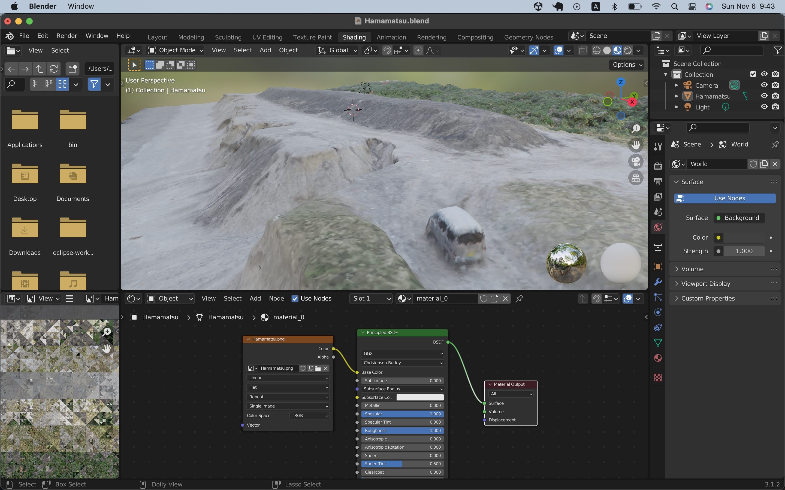

# Point cloud
 


## Processing pipeline

```
CloudCompare => MeshLab => Blender
```

## Data source

"Hamamatsu.blend" was generated through the pipeline above, and its data source is from the following site.

- https://pointcloud.pref.shizuoka.jp/ (This site does not seem to be working any longer?)


